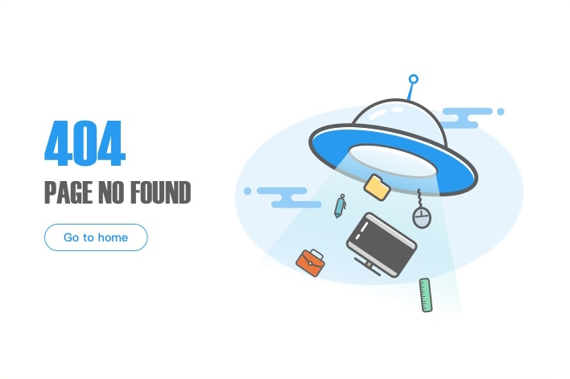

# Apie projektą

Paprastas paragrafas su [nuoroda](https://example.com).



## Antro lygio antraštė

Kažkoks tekstas **apie projektą**.

### Trečio lygio antraštė

```
<!DOCTYPE html>
<html lang="en">

<head>
    <meta charset="UTF-8">
    <meta name="viewport" content="width=device-width, initial-scale=1.0">
    <title>Ufo</title>
</head>

<body>
    CONTENT
</body>

</html>
```

```js
const x = 5;

function sum (a, b) {
    return a + b;
}

```

Kažkoks tekstas _apie projektą_.

#### Ketvirto lygio antraštė

>> Kažkoks tekstas apie projektą arba tekstas yra citata.

##### Penkto lygio antraštė


###### Šešto lygio antraštė
